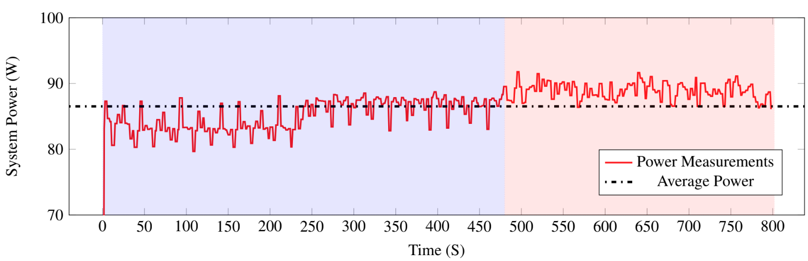

# Tools for monitoring power usage

## `monitor.py`
Log power usage from a TP-link Kasa device. 

`python3 monitor.py <IP>` were `<ip>` is the ip of the Kasa device, such as `192.168.1.192`.

### Sample Measurements

## `plot.py`

Plot data from the logfile. 
`python3 plot.py <logfile>`